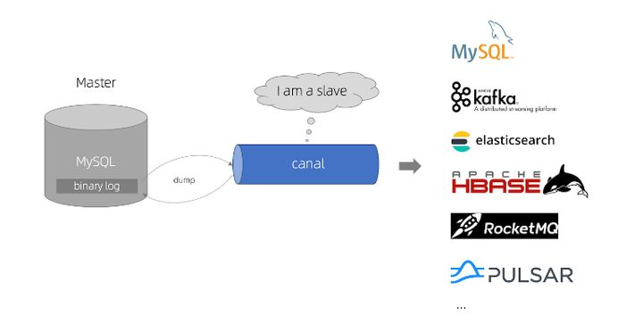
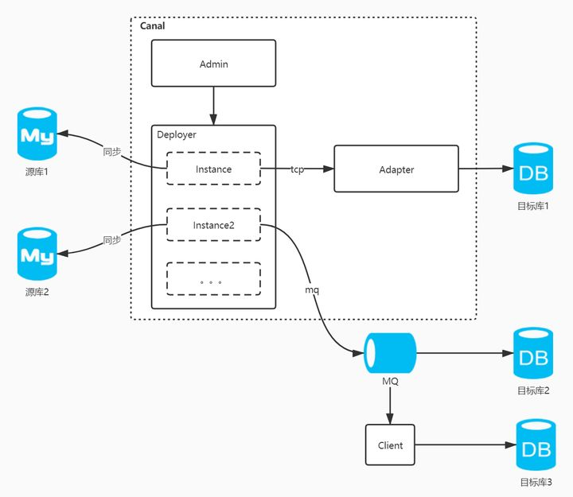
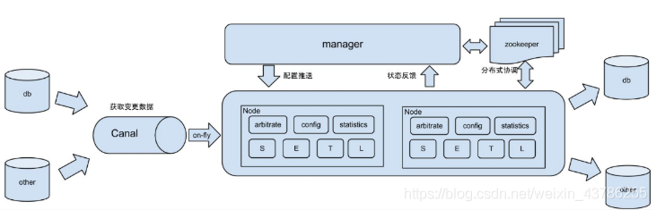
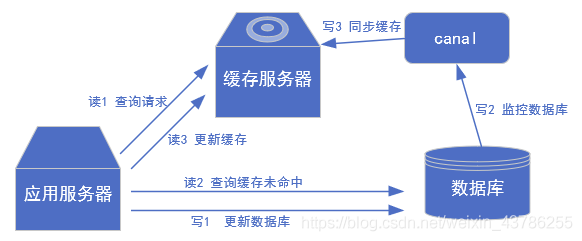
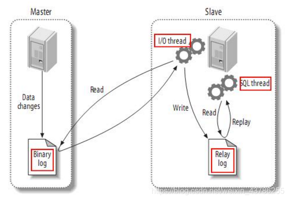
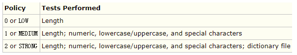
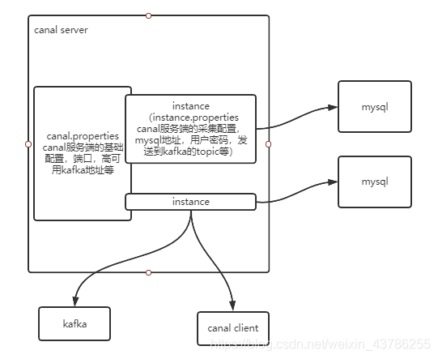

# canal

## 一、简介
canal是用java开发的基于数据库增量日志解析，提供增量数据订阅&消费的中间件。目前，canal主要支持了MySQL的binlog解析，解析完成后才利用canal client 用来处理获得的相关数据。（数据库同步需要阿里的otter中间件，基于canal）


总体架构：   
    

## 二、使用场景
1、阿里otter（阿里用于进行异地数据库之间的同步框架）中间件的一部分，这是原始场景
    

2、更新缓存：如果有大量的请求发送到mysql的话，mysql查询速度慢，QPS上不去，光查mysql可能会瘫痪，那就可以在前面加个缓存，这个缓存有2个主要的问题。一是缓存没有怎么办，二是数据不一致怎么办。对于第一个问题查缓存没有就差mysql，mysql再往缓存中写一份。对于第二个问题，如果数据库修改了，那就采用异步的方式进行修改，启动一个canal服务，监控mysql，只要一有变化就同步缓存，这样mysql和缓存就能达到最终的一致性。
    

3、抓取业务数据新增变化表，用于制作拉链表：做拉链表是需要有增加时间和修改时间的，需要数据今天新增和变化的数据，如果时间不全就没办法知道哪些是修改的。可以通过canal把变化的抽到自己的表里，以后数据就从这个表出。

4、取业务表的新增变化数据，用于制作实时统计

## 三、canal工作原理
首先了解一下mysql主备复制原理：
- master主库将改变记录，发送到二进制文件（binary log）中
- slave从库向mysql Master发送dump协议，将master主库的binary log events拷贝到它的中继日志（relay log）
- slave从库读取并重做中继日志中的事件，将改变的数据同步到自己的数据库
canal的工作原理：把自己伪装成slave，从master复制数据。读取binlog是需要master授权的，因为binlog是加密的，授权分用户名密码才能读。master授权后不知道读他的binlog的是从机还是canal，他的所有传输协议都符合从机的标准，所以master一直以为是从机读的。
  

## 四、mysql的binlog
### 4.1、二进制日志
mysql的二进制日志记录了所有的DDL和DML（除了数据查询语句），以事件的形式进行记录，包含语句执行消耗的时间，mysql的二进制日志是事务安全型的。

开启二进制日志大概会有1%的性能损坏。二进制日志有2个主要的使用场景：①mysql的主备复制②数据恢复，通过使用mysqlbinlog工具来恢复数据（用这个做恢复是备选方案，主方案还是定期快照，定期执行脚本导数据，其实就是把当前所有数据导成insert，这个量少）
二进制日志包括2类文件：①二进制日志索引文件（后缀为.index）用于记录所有的二进制文件②二进制日志文件（后缀为.00000*）记录数据库所有的DDL和DML（除了数据查询语句）

二进制日志包括2类文件：①二进制日志索引文件（后缀为.index）用于记录所有的二进制文件②二进制日志文件（后缀为.00000*）记录数据库所有的DDL和DML（除了数据查询语句）

### 4.2、开启binlog
修改mysql的配置文件my.cnf。
```
# vim /etc/my.cnfgG
```
在[mysqld] 区块 添加
```
log-bin=mysql-bin
```
mysql-bin表示binlog日志的前缀，以后生成的的日志文件就是 mysql-bin.000001 的文件后面的数字按顺序生成。 当mysql重启或到达单个文件大小的阈值时，新生一个文件，按顺序编号。

### 4.3、binlog分类
binlog的格式有三种：STATEMENT,MIXED,ROW对比如下
```
格式	描述	优点	
STATEMENT	语句级别，记录每一次执行写操作的语句，相对于ROW模式节省了空间，但是可能产生数据不一致如update tt set create_date=now()，由于执行时间不同产生饿得数据就不同	节省空间	可能造成数据不一致
ROW	行级，记录每次操作后每行记录的变化。假如一个update的sql执行结果是1万行statement只存一条，如果是row的话会把这个1000行的结果存这。	持数据的绝对一致性。因为不管sql是什么，引用了什么函数，他只记录执行后的效果	占用较大空间
MIXED	是对statement的升级，如当函数中包含 UUID() 时，包含 AUTO_INCREMENT 字段的表被更新时，执行 INSERT DELAYED 语句时，用 UDF 时，会按照 ROW的方式进行处理	节省空间，同时兼顾了一定的一致性	还有些极个别情况依旧会造成不一致，另外statement和mixed对于需要对binlog的监控的情况都不方便
```

### 4.4、binlog格式选择
如果只考虑主从复制的话可以用mixed，一般情况下使用statement，遇到几种特殊情况使用row，同步的话有SQL就行，因为手里有数据，前提是有数据才能执行这个SQL。在大数据场景下我们抽取数据是用于统计分析，分析的数据，如果用statement抽了SQL手里也没数据，不知道执行修改哪些，因为没有数据，所以没办法分析，所以适合用row，清清楚楚的表明了每一行是什么样。

### 4.5、修改配置文件
修改my.cnf文件，在[mysqld]模块下添加如下内容
```
server-id= 1
log-bin=mysql-bin
binlog_format=row
binlog-do-db=bigdata
```
binlog-do-db用于指定库，缩小监控的范围，server-id不能和mysql集群的其他节点重复

### 4.6、重启mysql
```
# service mysqld restart
Redirecting to /bin/systemctl restart mysqld.service
```
到数据目录下查询是否生成binlog文件，这里我把数据目录自定义为了/data/mysql/
```
# cd /data/mysql/
# ll
total 188500
-rw-r----- 1 mysql mysql       56 Jul  1  2020 auto.cnf
-rw------- 1 mysql mysql     1676 Jul  1  2020 ca-key.pem
-rw-r--r-- 1 mysql mysql     1112 Jul  1  2020 ca.pem
-rw-r--r-- 1 mysql mysql     1112 Jul  1  2020 client-cert.pem
-rw------- 1 mysql mysql     1676 Jul  1  2020 client-key.pem
drwxr-x--- 2 mysql mysql     4096 Jul  1  2020 dataxweb
-rw-r----- 1 mysql mysql      526 Jan 14 11:03 ib_buffer_pool
-rw-r----- 1 mysql mysql 79691776 Jan 14 11:04 ibdata1
-rw-r----- 1 mysql mysql 50331648 Jan 14 11:04 ib_logfile0
-rw-r----- 1 mysql mysql 50331648 Aug  5 06:20 ib_logfile1
-rw-r----- 1 mysql mysql 12582912 Jan 14 11:04 ibtmp1
drwxr-x--- 2 mysql mysql      116 Jul  1  2020 iot
drwxr-x--- 2 mysql mysql     4096 Jul  1  2020 mysql
-rw-r----- 1 mysql mysql      154 Jan 14 11:03 mysql-bin.000001
-rw-r----- 1 mysql mysql       19 Jan 14 11:03 mysql-bin.index
srwxrwxrwx 1 mysql mysql        0 Jan 14 11:03 mysql.sock
-rw------- 1 mysql mysql        6 Jan 14 11:03 mysql.sock.lock
drwxr-x--- 2 mysql mysql     8192 Jul  1  2020 performance_schema
-rw------- 1 mysql mysql     1680 Jul  1  2020 private_key.pem
-rw-r--r-- 1 mysql mysql      452 Jul  1  2020 public_key.pem
-rw-r--r-- 1 mysql mysql     1112 Jul  1  2020 server-cert.pem
-rw------- 1 mysql mysql     1676 Jul  1  2020 server-key.pem
drwxr-x--- 2 mysql mysql     8192 Jul  1  2020 sys
```
可以发现，这二进制日志索引文件和日志文件生成了。只要重启mysql，mysql-bin后面的序号就会往上涨，他的切分规则就是重启或者到一个大小的阈值，就会切一个
```
mysql-bin.000001
mysql-bin.index
```

## 五、安装canal
### 5.1、下载地址
```
https://github.com/alibaba/canal/releases
```

### 5.2、mysql为canal配置权限
在mysql中给canal单独建一个用户，给全库全表的读，拷贝，复制的权限
```
GRANT SELECT, REPLICATION SLAVE, REPLICATION CLIENT ON *.* TO 'canal'@'%' IDENTIFIED BY 'canal' ;
```
报错：ERROR 1819 (HY000): Your password does not satisfy the current policy requirements

原因是因为密码设置的过于简单会报错,MySQL有密码设置的规范，具体是与validate_password_policy的值有关,下图表明该值规则
  

查看MySQL完整的初始密码规则,登陆后执行以下命令
```
mysql> SHOW VARIABLES LIKE 'validate_password%';
+--------------------------------------+--------+
| Variable_name                        | Value  |
+--------------------------------------+--------+
| validate_password_check_user_name    | OFF    |
| validate_password_dictionary_file    |        |
| validate_password_length             | 8      |
| validate_password_mixed_case_count   | 1      |
| validate_password_number_count       | 1      |
| validate_password_policy             | MEDIUM |
| validate_password_special_char_count | 1      |
+--------------------------------------+--------+
```
 密码的长度是由validate_password_length决定的,但是可以通过以下命令修改
```
set global validate_password_length=4;
```
validate_password_policy决定密码的验证策略,默认等级为MEDIUM(中等),可通过以下命令修改为LOW(低)
```
set global validate_password_policy=0;
```
重新执行
```
GRANT SELECT, REPLICATION SLAVE, REPLICATION CLIENT ON *.* TO 'canal'@'%' IDENTIFIED BY 'canal' ;
```

### 5.3、解压及配置
```
$ tar -zxvf canal.deployer-1.1.4.tar.gz
```
配置说明：canal server的conf下有几个配置文件
```
conf/
├── canal_local.properties
├── canal.properties
├── example
│   ├── h2.mv.db
│   ├── instance.properties
│   └── meta.dat
├── logback.xml
├── metrics
│   └── Canal_instances_tmpl.json
└── spring
    ├── base-instance.xml
    ├── default-instance.xml
    ├── file-instance.xml
    ├── group-instance.xml
    ├── memory-instance.xml
    └── tsdb
        ├── h2-tsdb.xml
        ├── mysql-tsdb.xml
        ├── sql
        │   └── create_table.sql
        └── sql-map
            ├── sqlmap-config.xml
            ├── sqlmap_history.xml
            └── sqlmap_snapshot.xml
```
canal.properties的common属性前四个配置项：
```
canal.id= 1             #canal的编号，在集群环境下，不同canal的id不同，注意它和mysql的server_id不同。
canal.ip=               # ip这里不指定，默认为本机
canal.port= 11111       # 端口号,是给tcp模式（netty）时候用的，如果用了kafka或者rocketmq，就不会去起这个端口了
canal.zkServers=         # zk用于canal cluster
canal.serverMode = tcp   # 用于指定什么模式拉取数据
```
destinations相关的配置：
```
#################################################
#########       destinations        ############# 
#################################################
canal.destinations = example
canal.conf.dir = ../conf
canal.auto.scan = true
canal.auto.scan.interval = 5

canal.instance.global.mode = spring 
canal.instance.global.lazy = false
canal.instance.global.spring.xml = classpath:spring/file-instance.xml
```
canal.destinations = example可以设置多个，比如example1,example2，则需要创建对应的两个文件夹，并且每个文件夹下都有一个instance.properties文件。

全局的canal实例管理用spring，这里的file-instance.xml最终会实例化所有的destinations instances:
```
<bean id="instance" class="com.alibaba.otter.canal.instance.spring.CanalInstanceWithSpring">
        <property name="destination" value="${canal.instance.destination}" />
        <property name="eventParser">
                <ref local="eventParser" />
        </property>
        <property name="eventSink">
                <ref local="eventSink" />
        </property>
        <property name="eventStore">
                <ref local="eventStore" />
        </property>
        <property name="metaManager">
                <ref local="metaManager" />
        </property>
        <property name="alarmHandler">
                <ref local="alarmHandler" />
        </property>
<property name="mqConfig">
    <ref local="mqConfig" />
</property>
</bean>
```
如canal.instance.destination等于example，就会加载example/instance.properties配置文件   
修改instance 配置文件  
```
vi conf/example/instance.properties
```
```
#  按需修改成自己的数据库信息
#################################################
...
canal.instance.master.address=10.0.165.1:3306
# username/password,数据库的用户名和密码
...
canal.instance.dbUsername = canal
canal.instance.dbPassword = canal
#################################################
```

## 六、canal的instance与消费方式
 
canal.properties这个配置文件负责的是canal服务的基础配置，每个canal可以起n多个实例instance，一个instance代表一个线程，每个instance都有一个独立的配置文件instance.properties，不同的instance可以采集不同的mysql数据库，也就是一个canal可以对应多个mysql数据库。

在instance里面有一个小队列，可以理解为是jvm级的队列，instance抓取来的数据先放入到队列中，队列可以有很多出口：①一个是canal server自己主动把数据推送到kafka，这个比较简单，一行代码不用写，只需要配个kafka的地址，每个instance对应kafka的一个topic，数据是json串。这种方式虽然简单，但是他的缺点主要体现在2个方面，一个instance对应一个topic，所有表都在这一个topic，所以实时的时候要进行分流。另一方面，因为数据是json，并且携带了很多冗余信息，但是数据量大的时候传输效率比较低。②第二种方式是启动canal客户端主动去拉取数据，可以定义多长周期消费多少数据。他的缺点在于抓取出来的是序列化压缩的数据，所以需要反序列化，解压，比较麻烦。他的优点在于我们可以进行压缩，过滤掉没用的冗余信息，只保留我们需要的信息，提交传输效率。
```
$ ll
total 16
-rwxrwxr-x 1 canal canal  291 Sep  2  2019 canal_local.properties
-rwxrwxr-x 1 canal canal 5202 Jan 14 12:10 canal.properties
drwxrwxr-x 2 canal canal   33 Jan 14 12:15 example
-rwxrwxr-x 1 canal canal 3119 Sep  2  2019 logback.xml
drwxrwxr-x 2 canal canal   39 Jan 14 12:00 metrics
drwxrwxr-x 3 canal canal  149 Jan 14 12:00 spring
```
一个example的目录就是一个instance，canal要配置多个实例采集多个数据源mysql的话如下配置，然后把conf目录下example复制多份，分别重命名。如下
```
#################################################
#########               destinations            #############
#################################################
canal.destinations = example1,example2,example3
```

## 七、canal server主动推送数据
### 7.1、配置
修改配置vim conf/canal.properties：这个是总配置，端口号，服务器参数，kafka地址，zookeeper地址（高可用）等  
修改如下内容，这个zookeeper是配置高可用的，配置采用kafka方式，kafka的地址  
```
canal.zkServers = 10.0.165.4:2181,10.0.165.5:2181,10.0.165.6:2181
canal.serverMode = kafka
canal.mq.servers = 10.0.165.8:9092,10.0.165.9:9092
```
修改配置vim conf/example/instance.properties针对要追踪的mysql的实例配置：一个instance实例对应一个数据库（这个是指数据库服务器）服务器的binlog。所以一个instance具体采集几个数据库是binlog定的和canal没关系，canal不管，canal就把binlog里面有什么就采集，不管是一个数据库还是多个，只要在一个binlog都采集

修改如下内容，配置用户名，密码，地址。canal.mq.partitionsNum这个是发送到第几个分区
```
canal.instance.master.address=10.0.165.1:3306
canal.instance.dbUsername=canal
canal.instance.dbPassword=canal
canal.mq.topic=ods_bigdata_mysql
```

### 7.2、启动canal
```
./bin/startup.sh
```

### 7.3、测试
启动canal后，在kafka创建topic
```
bin/kafka-topics.sh --create --zookeeper 10.0.165.4:2181 --replication-factor 2 --partitions 12 --topic ods_bigdata_mysql
```
到kafka目录下开销消费端查询是否有数据
```
bin/kafka-console-consumer.sh --bootstrap-server  10.0.165.8:9092,10.0.165.9:9092 --topic  ods_bigdata_mysql
```
（1）往需要采集的库中的user_info表插入一条数据数据   
执行sql  
```
insert  into user_info values (10001,'test','test',NULL,'test','11111111111','111@gmail.com',NULL,'3','1999-09-09','F','2020-02-02 02:02:02',NULL)
```
可以看到kafka消费出了如下一条数据
```
{"data":[{"id":"10001","login_name":"test","nick_name":"test","passwd":null,"name":"test","phone_num":"11111111111","email":"111@gmail.com","head_img":null,"user_level":"3","birthday":"1999-09-09","gender":"F","create_time":"2020-02-02 02:02:02","operate_time":null}],"database":"bigdata","es":1610676724000,"id":2,"isDdl":false,"mysqlType":{"id":"bigint(20)","login_name":"varchar(200)","nick_name":"varchar(200)","passwd":"varchar(200)","name":"varchar(200)","phone_num":"varchar(200)","email":"varchar(200)","head_img":"varchar(200)","user_level":"varchar(200)","birthday":"date","gender":"varchar(1)","create_time":"datetime","operate_time":"datetime"},"old":null,"pkNames":["id"],"sql":"","sqlType":{"id":-5,"login_name":12,"nick_name":12,"passwd":12,"name":12,"phone_num":12,"email":12,"head_img":12,"user_level":12,"birthday":91,"gender":12,"create_time":93,"operate_time":93},"table":"user_info","ts":1610676724288,"type":"INSERT"}
```
（2）更新前面插入的这条数据   
执行sql
```
UPDATE user_info SET name="update" WHERE id=10001
```
kafka消费出的数据如下
```
{"data":[{"id":"10001","login_name":"test","nick_name":"test","passwd":null,"name":"update","phone_num":"11111111111","email":"111@gmail.com","head_img":null,"user_level":"3","birthday":"1999-09-09","gender":"F","create_time":"2020-02-02 02:02:02","operate_time":null}],"database":"bigdata","es":1610676928000,"id":3,"isDdl":false,"mysqlType":{"id":"bigint(20)","login_name":"varchar(200)","nick_name":"varchar(200)","passwd":"varchar(200)","name":"varchar(200)","phone_num":"varchar(200)","email":"varchar(200)","head_img":"varchar(200)","user_level":"varchar(200)","birthday":"date","gender":"varchar(1)","create_time":"datetime","operate_time":"datetime"},"old":[{"name":"test"}],"pkNames":["id"],"sql":"","sqlType":{"id":-5,"login_name":12,"nick_name":12,"passwd":12,"name":12,"phone_num":12,"email":12,"head_img":12,"user_level":12,"birthday":91,"gender":12,"create_time":93,"operate_time":93},"table":"user_info","ts":1610676928644,"type":"UPDATE"}
```
（3）删除前面插入的这条数据   
执行sql
```
DELETE FROM user_info WHERE id=10001
```
kafka消费出的数据如下
```
{"data":[{"id":"10001","login_name":"test","nick_name":"test","passwd":null,"name":"update","phone_num":"11111111111","email":"111@gmail.com","head_img":null,"user_level":"3","birthday":"1999-09-09","gender":"F","create_time":"2020-02-02 02:02:02","operate_time":null}],"database":"bigdata","es":1610677003000,"id":4,"isDdl":false,"mysqlType":{"id":"bigint(20)","login_name":"varchar(200)","nick_name":"varchar(200)","passwd":"varchar(200)","name":"varchar(200)","phone_num":"varchar(200)","email":"varchar(200)","head_img":"varchar(200)","user_level":"varchar(200)","birthday":"date","gender":"varchar(1)","create_time":"datetime","operate_time":"datetime"},"old":null,"pkNames":["id"],"sql":"","sqlType":{"id":-5,"login_name":12,"nick_name":12,"passwd":12,"name":12,"phone_num":12,"email":12,"head_img":12,"user_level":12,"birthday":91,"gender":12,"create_time":93,"operate_time":93},"table":"user_info","ts":1610677003637,"type":"DELETE"}
```

## 八、canal主动拉取数据客户端
### 8.1、修改配置
修改canal.properties，zookeeper配置高可用，配置采用tcp方式
```
canal.zkServers = 10.0.165.4:2181,10.0.165.5:2181,10.0.165.6:2181
canal.serverMode = tcp
```
注意：需要修改canal.proerties的canal.serverMode为tcp否则不会启动11111端口  
修改instance.properties，配置用户名，密码，地址。  
```
canal.instance.master.address=10.0.165.1:3306
canal.instance.dbUsername=canal
canal.instance.dbPassword=canal
```
重新启动后查看11111端口是否被占用
```
[canal@fbi-local-02 bin]$ lsof -i:11111
COMMAND   PID  USER   FD   TYPE  DEVICE SIZE/OFF NODE NAME
java    38516 canal  108u  IPv4 4281763      0t0  TCP fbi-local-02:vce (LISTEN)
```

### 8.2、将binlog转换为ProtoBuf消息
（1）编写proto描述文件CanalBinLog.proto
```
syntax = "proto3";
option java_package = "com.quinto.canal";
option java_outer_classname = "CanalBinLog";

/* 行数据 */
message RowData {
    uint64 executeTime = 1;
    string schemaName = 2;
    string tableName = 3;
    string eventType = 4;
    /* 列数据 */
    map<string, string> columns = 5;
    uint64 logfileoffset = 14;
    string logfilename = 15;
}
```
（2）canal客户端代码编写  
导入依赖
```
<properties>
    <protobuf.version>3.5.0</protobuf.version>
    <kafka.client.version>1.0.0</kafka.client.version>
    <kafka.version>0.11.0.2</kafka.version>
    <canal.version>1.1.4</canal.version>
</properties>
<dependencies>
<dependency>
        <groupId>com.alibaba.otter</groupId>
        <artifactId>canal.client</artifactId>
        <version>${canal.version}</version>
    </dependency>
    <dependency>
        <groupId>com.google.protobuf</groupId>
        <artifactId>protobuf-java</artifactId>
        <version>${protobuf.version}</version>
    </dependency>
    <!-- kafka -->
    <dependency>
        <groupId>org.apache.kafka</groupId>
        <artifactId>kafka_2.11</artifactId>
        <version>${kafka.version}</version>
    </dependency>
    <dependency>
        <groupId>org.apache.kafka</groupId>
        <artifactId>kafka-clients</artifactId>
        <version>${kafka.client.version}</version>
    </dependency>
</dependency>
```


参考资料：  
Canal原理及其使用   
https://blog.csdn.net/weixin_43786255/article/details/113754915  
Canal高可用架构部署   
https://zhuanlan.zhihu.com/p/358865073   

