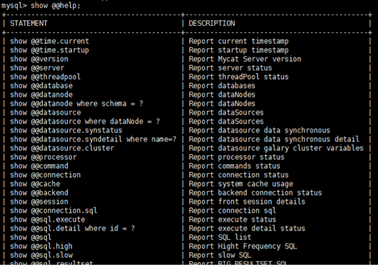

# MyCat起步

Mycat的官网    
http://www.mycat.io/ 

### 一、安装
获取MyCAT的最新开源版本：    
http://www.mycat.org.cn/

笔者此处搭建的环境各软件版本：
- CentOS release 6.5 (Final)
- Mycat-server-1.6-RELEASE-20161028204710-linux.tar.gz
- Jdk 1.7.0_71
- mysql Ver 14.14 Distrib 5.5.49,

MyCat 三个配置文件
- schema.xml：定义逻辑库，表、分片节点等内容 
- rule.xml：定义分片规则 
- server.xml：定义用户以及系统相关变量，如端口等 

### 二、配置
#### 3.1、server.xml
修改用户信息，与MySQL区分，如下：   
```xml
<user name="root">
    <property name="password">root</property>
    <property name="schemas">TESTDB</property>
    
    <!-- 表级 DML 权限设置 -->
    <!-- 		
    <privileges check="false">
        <schema name="TESTDB" dml="0110" >
            <table name="tb01" dml="0000"></table>
            <table name="tb02" dml="1111"></table>
        </schema>
    </privileges>		
     -->
</user>
```

#### 3.2、schema.xml
删除<schema>标签间的表信息， <dataNode>标签只留一个， <dataHost>标签只留一个， <writeHost> <readHost>只留一对 
```xml
<?xml version="1.0"?>
<!DOCTYPE mycat:schema SYSTEM "schema.dtd">
<mycat:schema xmlns:mycat="http://io.mycat/">
	<schema name="TESTDB" checkSQLschema="false" sqlMaxLimit="100" dataNode="dn1"> 
		
	</schema>
	
	<dataNode name="dn1" dataHost="localhost1" database="testdb"/> 
	
	<dataHost name="localhost1" maxCon="1000" minCon="10" balance="0"
			  writeType="0" dbType="mysql" dbDriver="native" switchType="1"  slaveThreshold="100">
		<heartbeat>select user()</heartbeat>
		<!-- can have multi write hosts -->
		<writeHost host="hostM1" url="localhost:3306" user="root" password="root">
			<!-- can have multi read hosts -->
			<readHost host="hostS2" url="localhost:3306" user="root" password="root" />
		</writeHost>
		<writeHost host="hostS1" url="localhost:3316" user="root"
				   password="123456" />
		<!-- <writeHost host="hostM2" url="localhost:3316" user="root" password="123456"/> -->
	</dataHost>
</mycat:schema>
```

### 三、启动
#### 3.1、验证数据库访问情况 
Mycat 作为数据库中间件要和数据库部署在不同机器上，所以要验证远程访问情况。 
```
mysql -uroot -proot -h 192.168.25.128 -P 3306
mysql -uroot -proot -h 192.168.25.129 -P 3306 

#如远程访问报错，请建对应用户 
grant all privileges on *.* to root@'缺少的host'  identified by '123123'; 
```

### 3.2、启动程序 
- 控制台启动 ：去 mycat/bin 目录下执行 ./mycat console 
- 后台启动 ：去 mycat/bin 目录下 ./mycat start    
为了能第一时间看到启动日志，方便定位问题，我们选择①控制台启动。 

### 3.3、可能出现的报错
WrapperSimpleApp: Encountered an error running main: java.lang.NoClassDefFoundError: java/util/concurrent/atomic/LongAdder    
解决：Mycat的版本1.6.7,JDK版本1.7.1,由于Mycat的版本略高改成1.6问题解决了。    
更改MyCat的版本为：Mycat-server-1.6-RELEASE-20161028204710-linux.tar.gz   

### 四、登录
### 4.1、登录后台管理窗口 
此登录方式用于管理维护 Mycat 
```
mysql -umycat -proot -P 9066 -h 192.168.25.128

show @@help 
```


### 4.2、登录数据窗口 
此登录方式用于通过 Mycat 查询数据，此处选择这种方式访问 Mycat 
```
mysql -umycat -proot -P 8066 -h 192.168.25.128 
```
