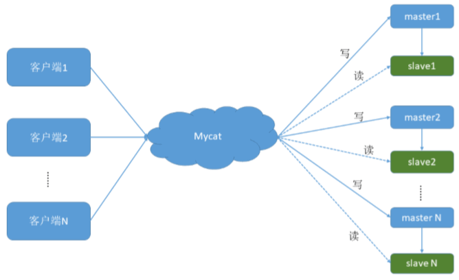
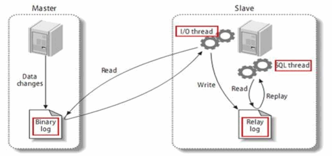
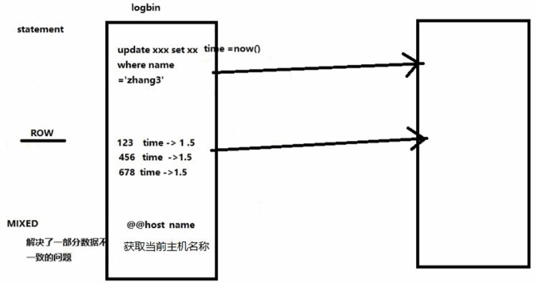
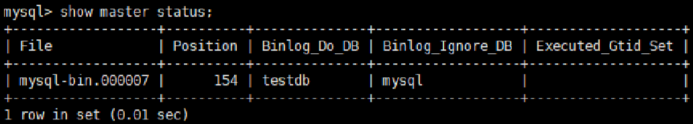
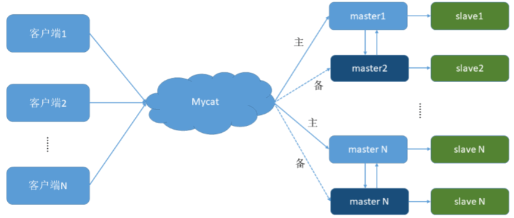
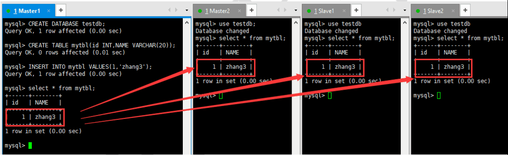

# 02-搭建MySql主从复制

通过 Mycat 和 MySQL 的主从复制配合搭建数据库的读写分离，实现 MySQL 的高可用性。  
该文档将搭建：一主一从、双主双从两种读写分离模式。 

### 一、搭建一主一从
一个主机用于处理所有写请求，一台从机负责所有读请求，架构图如下：


#### 1.1、搭建 MySQL 数据库主从复制 
##### 1. MySQL 主从复制原理 


##### 2. 主机配置(VM128) 
```
修改配置文件：vim /etc/my.cnf 
#主服务器唯一ID 
server-id=1  
#启用二进制日志 
log-bin=mysql-bin 
# 设置不要复制的数据库(可设置多个) 
binlog-ignore-db=mysql 
binlog-ignore-db=information_schema 
#设置需要复制的数据库 
binlog-do-db=需要复制的主数据库名字 
#设置logbin格式 binlog_format=STATEMENT 
```


##### 3. 从机配置(VM130) 
```
修改配置文件：vim /etc/my.cnf 
#从服务器唯一ID 
server-id=2  
#启用中继日志 
relay-log=mysql-relay 
```

##### 4. 主机、从机重启 MySQL 服务 
##### 5. 主机从机都关闭防火墙 
##### 6. 在主机上建立帐户并授权 slave 
```
#在主机MySQL里执行授权命令 
GRANT REPLICATION SLAVE ON *.* TO 'slave'@'%' IDENTIFIED BY 'slave'; 
#查询master的状态 
show master status; 
```

```
 +------------------+----------+--------------+--------------------------+
 | File             | Position | Binlog_Do_DB | Binlog_Ignore_DB         |
 +------------------+----------+--------------+--------------------------+
 | mysql-bin.000001 |      107 | testdb       | mysql,information_schema |
 +------------------+----------+--------------+--------------------------+
 
 *************************** 1. row ***************************
             File: mysql-bin.000001
         Position: 107
     Binlog_Do_DB: testdb
 Binlog_Ignore_DB: mysql,information_schema
```


记录下File和Position的值。   
执行完此步骤后不要再操作主服务器MySQL，防止主服务器状态值变化。    

##### 7. 在从机上配置需要复制的主机 
```
#复制主机的命令 
CHANGE MASTER TO MASTER_HOST='主机的IP地址',
MASTER_USER='slave', 
MASTER_PASSWORD='root', 
MASTER_LOG_FILE='mysql-bin.具体数字',
MASTER_LOG_POS=具体值; 
#启动从服务器复制功能 
start slave;
#查看从服务器状态 
show slave status\G; 
#下面两个参数都是Yes，则说明主从配置成功！ 
# Slave_IO_Running: Yes 
# Slave_SQL_Running: Yes 
```
```
mysql> show slave status\G; 
*************************** 1. row ***************************
               Slave_IO_State: Waiting for master to send event
                  Master_Host: 192.168.25.128
                  Master_User: slave
                  Master_Port: 3306
                Connect_Retry: 60
              Master_Log_File: mysql-bin.000001
          Read_Master_Log_Pos: 107
               Relay_Log_File: mysql-relay.000002
                Relay_Log_Pos: 253
        Relay_Master_Log_File: mysql-bin.000001
             Slave_IO_Running: Yes
            Slave_SQL_Running: Yes
              Replicate_Do_DB: 
          Replicate_Ignore_DB: 
           Replicate_Do_Table: 
       Replicate_Ignore_Table: 
      Replicate_Wild_Do_Table: 
  Replicate_Wild_Ignore_Table: 
                   Last_Errno: 0
                   Last_Error: 
                 Skip_Counter: 0
          Exec_Master_Log_Pos: 107
              Relay_Log_Space: 405
              Until_Condition: None
               Until_Log_File: 
                Until_Log_Pos: 0
           Master_SSL_Allowed: No
           Master_SSL_CA_File: 
           Master_SSL_CA_Path: 
              Master_SSL_Cert: 
            Master_SSL_Cipher: 
               Master_SSL_Key: 
        Seconds_Behind_Master: 0
Master_SSL_Verify_Server_Cert: No
                Last_IO_Errno: 0
                Last_IO_Error: 
               Last_SQL_Errno: 0
               Last_SQL_Error: 
  Replicate_Ignore_Server_Ids: 
             Master_Server_Id: 1
```

##### 8. 主机新建库、新建表、insert 记录，从机复制 
```sql
create DATABASE testdb;
create TABLE mytbl (id INT,name VARCHAR(20));
INSERT INTO mytbl VALUES (1,'zhangsan');
```

##### 9. 如何停止从服务复制功能 
```
stop slave; 
```

##### 10. 如何重新配置主从
```
stop slave;  
reset master; 
reset slave; 
```

#### 1.2、修改 Mycat 的配置文件 schema.xml 
上述的配置已分配了读写主机，是否已实现读写分离？ 

验证读写分离
- 在写主机插入：insert into mytbl values (1,@@hostname); 主从主机数据不一致了。
- 在Mycat里查询：select * from mytbl; 

修改<dataHost>的balance属性，通过此属性配置读写分离的类型。   
负载均衡类型，目前的取值有4 种：    
- balance="0", 不开启读写分离机制，所有读操作都发送到当前可用的 writeHost 上。 
- balance="1"，全部的 readHost 与 stand by writeHost 参与 select 语句的负载均衡，简单的说，当双主双从 模式(M1->S1，M2->S2，并且 M1 与 M2 互为主备)，正常情况下，M2,S1,S2 都参与 select 语句的负载均衡。 
- balance="2"，所有读操作都随机的在 writeHost、readhost 上分发。 
- balance="3"，所有读请求随机的分发到 readhost 执行，writerHost 不负担读压力 

为了能看到读写分离的效果，把balance设置成2，会在两个主机间切换查询 
```
<dataHost name="localhost1" maxCon="1000" minCon="10" balance="2"
			  writeType="0" dbType="mysql" dbDriver="native" switchType="1"  slaveThreshold="100">
```

启动 Mycat 

验证读写分离 
1. 在写主机数据库表mytbl中插入带系统变量数据，造成主从数据不一致 INSERT INTO mytbl VALUES(2,@@hostname); 
2. 在Mycat里查询mytbl表,可以看到查询语句在主从两个主机间切换 


### 二、搭建双主双从
一个主机 m1 用于处理所有写请求，它的从机 s1 和另一台主机 m2 还有它的从机 s2 负责所有读请求。当 m1 主机宕机后，m2 主机负责写请求，m1、m2 互为备机。架构图如下 

```
 +------+----------+----------------+-----------------+
 | 编号 | 角色     |  IP地址         |机器名           |
 +------+----------+----------------+-----------------+
 | 01   |  Master1 |192.168.25.128  | VM128           |
 +------+----------+----------------+-----------------+
 | 02   |   slave1 |192.168.25.130  | VM130           |
 +------+----------+----------------+-----------------+
 | 03   |  Master2 |192.168.25.131  | VM131           |
 +------+----------+----------------+-----------------+
 | 04   |   slave2 |192.168.25.132  | VM132           |
 +------+----------+----------------+-----------------+
```

#### 1.1、 搭建 MySQL 数据库主从复制（双主双从） 
##### 1. 双主机配置 
Master1配置   
```
修改配置文件：vim /etc/my.cnf 
 
#主服务器唯一ID 
server-id=1  
#启用二进制日志 
log-bin=mysql-bin 
# 设置不要复制的数据库(可设置多个) 
binlog-ignore-db=mysql 
binlog-ignore-db=information_schema 
#设置需要复制的数据库 
binlog-do-db=需要复制的主数据库名字 
#设置logbin格式 
binlog_format=STATEMENT 
# 在作为从数据库的时候，有写入操作也要更新二进制日志文件 
log-slave-updates 
#表示自增长字段每次递增的量，指自增字段的起始值，其默认值是1，取值范围是1 .. 65535 
auto-increment-increment=2  
# 表示自增长字段从哪个数开始，指字段一次递增多少，他的取值范围是1 .. 65535 
auto-increment-offset=1  
```

Master2配置
```
修改配置文件：vim /etc/my.cnf 
 
#主服务器唯一ID 
server-id=3  
#启用二进制日志 
log-bin=mysql-bin 
# 设置不要复制的数据库(可设置多个) 
binlog-ignore-db=mysql 
binlog-ignore-db=information_schema 
#设置需要复制的数据库 
binlog-do-db=需要复制的主数据库名字 
#设置logbin格式 
binlog_format=STATEMENT 
# 在作为从数据库的时候，有写入操作也要更新二进制日志文件 
log-slave-updates  
#表示自增长字段每次递增的量，指自增字段的起始值，其默认值是1，取值范围是1 .. 65535 
auto-increment-increment=2  
# 表示自增长字段从哪个数开始，指字段一次递增多少，他的取值范围是1 .. 65535 
auto-increment-offset=2 
```

##### 2. 双从机配置 
Slave1配置 
```
修改配置文件：vim /etc/my.cnf 
#从服务器唯一ID 
server-id=2  
#启用中继日志 
relay-log=mysql-relay 
```

Slave2配置 
```
修改配置文件：vim /etc/my.cnf 
#从服务器唯一ID 
server-id=4  
#启用中继日志 
relay-log=mysql-relay 
```

##### 3. 双主机、双从机重启 mysql 服务 

##### 4. 主机从机都关闭防火墙 

##### 5. 在两台主机上建立帐户并授权 slave 
```
#在主机MySQL里执行授权命令 
GRANT REPLICATION SLAVE ON *.* TO 'slave'@'%' IDENTIFIED BY 'slave'; 
#查询Master1的状态 
show master status; 
#查询Master2的状态 
show master status; 
#分别记录下File和Position的值 
#执行完此步骤后不要再操作主服务器MYSQL，防止主服务器状态值变化 
```

##### 6. 在从机上配置需要复制的主机 
Slava1 复制 Master1，Slava2 复制 Master2 
```
#复制主机的命令 Slave1
CHANGE MASTER TO MASTER_HOST='192.168.25.128', 
MASTER_USER='slave', MASTER_PASSWORD='slave', 
MASTER_LOG_FILE='mysql-bin.000002',MASTER_LOG_POS=254; 

#复制主机的命令 Slave1
CHANGE MASTER TO MASTER_HOST='192.168.25.131', 
MASTER_USER='slave', MASTER_PASSWORD='slave', 
MASTER_LOG_FILE='mysql-bin.000001',MASTER_LOG_POS=254; 

#启动两台从服务器复制功能 
start slave; 

#查看从服务器状态 
show slave status\G; 

#下面两个参数都是Yes，则说明主从配置成功！ 
# Slave_IO_Running: Yes 
# Slave_SQL_Running: Yes 
```
##### 7. 两个主机互相复制 
Master2 复制 Master1，Master1 复制 Master2 
```
# Master2的复制命令 
CHANGE MASTER TO MASTER_HOST='192.168.25.128', 
MASTER_USER='slave', MASTER_PASSWORD='slave', 
MASTER_LOG_FILE='mysql-bin.000002',MASTER_LOG_POS=254; 

# Master1的复制命令 
CHANGE MASTER TO MASTER_HOST='192.168.25.131', 
MASTER_USER='slave', MASTER_PASSWORD='slave', 
MASTER_LOG_FILE='mysql-bin.000001',MASTER_LOG_POS=254; 

#启动两台主服务器复制功能 
start slave; 
 
#查看从服务器状态
show slave status\G; 
```

##### 8. Master1 主机新建库、新建表、insert 记录，Master2 和从机复制 


##### 9.如何停止从服务复制功能 
```
stop slave; 
```

##### 10.如何重新配置主从 
```
stop slave; 
reset master; 
```

#### 1.2、修改 Mycat 的配置文件 schema.xml 
为了双主双从读写分离balance设置为1 
```xml
<?xml version="1.0"?>
<!DOCTYPE mycat:schema SYSTEM "schema.dtd">
<mycat:schema xmlns:mycat="http://io.mycat/">
	<schema name="TESTDB" checkSQLschema="false" sqlMaxLimit="100" dataNode="dn1"> 
	</schema>
	
	<dataNode name="dn1" dataHost="localhost1" database="testdb"/> 
	<dataHost name="localhost1" maxCon="1000" minCon="10" balance="1"
			  writeType="0" dbType="mysql" dbDriver="native" switchType="1"  slaveThreshold="100">
		<heartbeat>select user()</heartbeat>
		<!-- can have multi write hosts -->
		<writeHost host="hostM1" url="192.168.25.128:3306" user="root" password="root">
			<!-- can have multi read hosts -->
			<readHost host="hostS1" url="192.168.25.130:3306" user="root" password="root" />
		</writeHost>

		<writeHost host="hostM2" url="192.168.25.131:3306" user="root" password="root">
			<!-- can have multi read hosts -->
			<readHost host="hostS2" url="192.168.25.132:3306" user="root" password="root" />
		</writeHost>
	</dataHost>
</mycat:schema>
```
```
#balance="1": 全部的readHost与stand by writeHost参与select语句的负载均衡。 
#writeType="0": 所有写操作发送到配置的第一个writeHost，第一个挂了切到还生存的第二个 
#writeType="1"，所有写操作都随机的发送到配置的 writeHost，1.5 以后废弃不推荐  
#writeHost，重新启动后以切换后的为准，切换记录在配置文件中:dnindex.properties 。 
#switchType="1": 1 默认值，自动切换。 
#              -1 表示不自动切换 
#              2 基于 MySQL 主从同步的状态决定是否切换。
```

#### 1.3、启动 Mycat 

#### 1.4、验证读写分离 
```
#在写主机Master1数据库表mytbl中插入带系统变量数据，造成主从数据不一致 
INSERT INTO mytbl VALUES(3,@@hostname); 
#在Mycat里查询mytbl表,可以看到查询语句在Master2、Slava1、Slava2 主从三个主机间切换 
```

#### 1.5、抗风险能力
```
#停止数据库Master1 
systemctl stop mysqld
systemctl status mysqld

#在Mycat里插入数据依然成功，Master2自动切换为写主机 
INSERT INTO mytabl VALUES(3,@@hostname); 

#启动数据库Master1  --> 之前的未执行语句会继续执行
#在Mycat里查询mytbl表,可以看到查询语句在Master1、Slava1、Slava2 主从三个主机间切换 
```
Master1、Master2 互做备机，负责写的主机宕机，备机切换负责写操作，保证数据库读写分离高可用性。 


Linux下修改主机名  
https://www.linuxidc.com/linux/2015-12/126057.htm
```
解决办法： vi /etc/sysconfig/network
追加一行： HOSTNAME=你的主机名
接着修改： vi     /etc/hosts
添加这句后面添加 你的主机名
127.0.0.1 localhost.localdomain localhost 你的主机名
```

