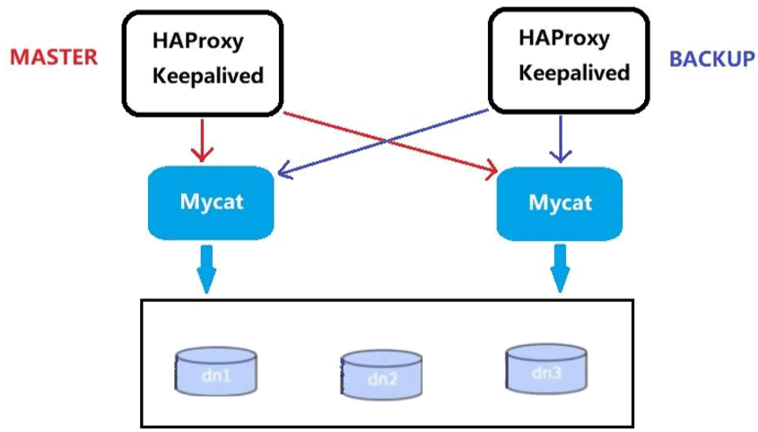
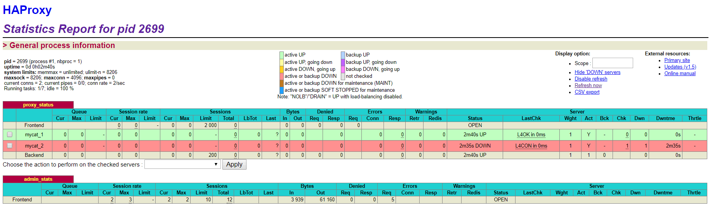

# 04-基于 HA 机制的 Mycat 高可用

在实际项目中，Mycat 服务也需要考虑高可用性，如果 Mycat 所在服务器出现宕机，或 Mycat 服务故障，需要有备机提供服务，需要考虑 Mycat 集群。 

### 一、高可用方案
可以使用HAProxy + Keepalived配合两台Mycat搭起Mycat集群，实现高可用性。HAProxy 实现了 MyCat 多节点的集群高可用和负载均衡， 而 HAProxy 自身的高可用则可以通过Keepalived 来实现。 


```
 +------+----------+----------------+-----------------+
 | 编号 | 角色     |  IP地址         |机器名           |
 +------+----------+----------------+-----------------+
 | 01   |  MyCat1  |192.168.25.128  | VM128           |
 +------+----------+----------------+-----------------+
 | 01   |  MyCat2  |192.168.25.135  | VM135           |
 +------+----------+----------------+-----------------+
 | 02   |  Hap-M   |192.168.25.136  | VM136           |
 +------+----------+----------------+-----------------+
 | 02   |  KA-M    |192.168.25.136  | VM136           |
 +------+----------+----------------+-----------------+
 | 03   |  Hap-S   |192.168.25.137  | VM137           |
 +------+----------+----------------+-----------------+
 | 04   |  KA-S    |192.168.25.137  | VM137           |
 +------+----------+----------------+-----------------+
```

### 二、安装配置 HAProxy 
#### 1、安装 HAProxy 
（1）准备好HAProxy安装包，传到/opt目录下   
（2）解压到/usr/local/src 
```
tar -zxvf haproxy-1.5.18.tar.gz -C /usr/local/src 
```
（3）进入解压后的目录，查看内核版本，进行编译   
```
cd /usr/local/src/haproxy-1.5.18   
uname -r   
# 2.6.32-431.el6.i686 ，则：
make TARGET=linux2632 PREFIX=/usr/local/haproxy ARCH=i686 

#ARGET=linux310，内核版本，使用uname -r查看内核，如：2.6.32-431.el6.i686，此时该参数就为 linux2632；
#ARCH=i686，系统位数； #PREFIX=/usr/local/haprpxy 
#/usr/local/haprpxy，为haprpxy安装路径。 
```
（4）编译完成后，进行安装 
```
make install PREFIX=/usr/local/haproxy  
```
（5）安装完成后，创建目录、创建HAProxy配置文件 
```
mkdir -p /usr/data/haproxy/ 
vim /usr/local/haproxy/haproxy.conf 
```
（6）向配置文件中插入以下配置信息,并保存 
``` bash
global         
    log 127.0.0.1   local0         
    #log 127.0.0.1   local1 notice         
    #log loghost    local0 info         
    maxconn 4096         
    chroot /usr/local/haproxy         
    pidfile /usr/data/haproxy/haproxy.pid         
    uid 99         
    gid 99         
    daemon         
    #debug         
    #quiet 
    
defaults       
	log     global 
	mode    tcp     
	option  abortonclose     
	option redispatch      
	retries 3      
	maxconn 2000    
	timeout connect 5000    
	timeout client  50000   
	timeout server  50000     
	
listen proxy_status 
	bind :48066       
		mode tcp         
		balance roundrobin   
		server mycat_1 192.168.25.128:8066 check inter 10s      
		server mycat_2 192.168.25.135:8066 check inter 10s 
 
frontend admin_stats 
	bind :7777       
		mode http       
		stats enable        
		option httplog        
		maxconn 10        
		stats refresh 30s   
		stats uri /admin      
		stats auth admin:admin   
		stats hide-version       
		stats admin if TRUE 	
```

#### 2、启动验证 
（1）启动HAProxy 
```
/usr/local/haproxy/sbin/haproxy -f /usr/local/haproxy/haproxy.conf 
```
（2）查看HAProxy进程 
```
ps -ef|grep haproxy 
```
（3）打开浏览器访问 
```
http://192.168.25.136:7777/admin 

在弹出框输入用户名：admin密码：admin 
如果Mycat主备机均已启动，则可以看到如下图 
```
（4）验证负载均衡，通过HAProxy访问Mycat 
```
mysql -uroot -proot -h 192.168.25.136 -P 48066 
```



### 三、配置 Keepalived  
#### 1、安装 Keepalived 
（1）准备好Keepalived安装包，传到/opt目录下   
（2）解压到/usr/local/src 
```
tar -zxvf keepalived-1.4.2.tar.gz -C /usr/local/src 
```
（3）安装依赖插件 
```
yum install -y gcc openssl-devel popt-devel 
```
（4）进入解压后的目录，进行配置，进行编译
```
cd /usr/local/src/keepalived-1.4.2 
./configure --prefix=/usr/local/keepalived 
```
（5）进行编译，完成后进行安装 
```
make && make install 
```
（6）运行前配置 
```
cp /usr/local/src/keepalived-1.4.2/keepalived/etc/init.d/keepalived /etc/init.d/ 
mkdir /etc/keepalived 
cp /usr/local/keepalived/etc/keepalived/keepalived.conf /etc/keepalived/ 
cp /usr/local/src/keepalived-1.4.2/keepalived/etc/sysconfig/keepalived /etc/sysconfig/ 
cp /usr/local/keepalived/sbin/keepalived /usr/sbin/ 
```
（7）修改配置文件 
```
vim /etc/keepalived/keepalived.conf 
#修改内容如下 
! Configuration File for keepalived 
 
global_defs {  
  notification_email {  
	xlcocoon@foxmail.com   
  }    
  notification_email_from keepalived@showjoy.com   
  smtp_server 127.0.0.1  
  smtp_connect_timeout 30  
  router_id LVS_DEVEL   
  vrrp_skip_check_adv_addr  
  vrrp_garp_interval 0 
  vrrp_gna_interval 0 
} 
 
vrrp_instance VI_1 { 
    #主机配MASTER，备机配BACKUP state MASTER
	#所在机器网卡 
    interface ens33 virtual_router_id 51
	#数值越大优先级越高    
	priority 100    
	advert_int 1    
	authentication {   
		auth_type PASS  
		auth_pass 1111  
	} 
	virtual_ipaddress { 
		#虚拟IP       
		192.168.25.200   
	} 
} 

virtual_server 192.168.25.200 48066 {  
	delay_loop 6    
	lb_algo rr   
	lb_kind NAT  
	persistence_timeout 50  
	protocol TCP 
	real_server 192.168.25.136 48066 {   
		weight 1 
		TCP_CHECK {  
			connect_timeout 3 
			retry 3          
			delay_before_retry 3     
		} 
	} 
	real_server 192.168.25.136 48600 {  
	weight 1      
		TCP_CHECK {    
			connect_timeout 3    
			nb_get_retry 3         
			delay_before_retry 3  
		}   
	} 
} 
```

#### 2、启动验证 
（1）启动Keepalived 
```
service keepalived start 
```
（2）登录验证 
```
mysql -uroot -proot -h 192.168.25.200 -P 48066 
```

### 四、测试高可用
（1）关闭mycat   
（2）通过虚拟ip查询数据 
```
mysql -umycat -p123456 -h 192.168.140.200 -P 48066 
```
