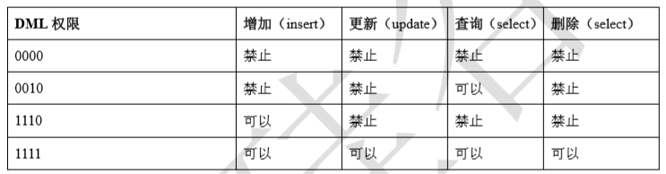

# 05-MyCat安全设置

### 一、权限配置
#### 1.user 标签权限控制 
目前 Mycat 对于中间件的连接控制并没有做太复杂的控制，目前只做了中间件逻辑库级别的读写权限控制。是通过 server.xml 的 user 标签进行配置。 
```
#server.xml配置文件user部分 
<user name="mycat">     
	<property name="password">mycat</property>   
	<property name="schemas">TESTDB</property> 
</user>

<user name="user">    
	<property name="password">user</property>   
	<property name="schemas">TESTDB</property>     
	<property name="readOnly">true</property>
</user> 
```

配置说明：
- name 应用连接中间件逻辑库的用户名 
- password 该用户对应的密码 
- TESTDB 应用当前连接的逻辑库中所对应的逻辑表。schemas 中可以配置一个或多个 
- readOnly 应用连接中间件逻辑库所具有的权限。true 为只读，false 为读写都有，默认为 false 

测试案例
```
测试案例一 
#    使用user用户，权限为只读（readOnly：true） 
#    验证是否可以查询出数据，验证是否可以写入数据 
```

（1）用user用户登录，运行命令如下： 
```
mysql -uuser -puser -h 192.168.25.128 -P8066 
```
（2）切换到TESTDB数据库，查询orders表数据，如下： 
```
use TESTDB 
select * from orders; 
```
（3）可以查询到数据  
（4）执行插入数据sql，如下： 
```
insert into orders(id,order_type,customer_id,amount) values(7,101,101,10000); 
```
（5）可看到运行结果，插入失败，只有只读权限。

#### 2.privileges 标签权限控制 
在 user 标签下的 privileges 标签可以对逻辑库（schema）、表（table）进行精细化的 DML 权限控制。

privileges 标签下的 check 属性，如为 true 开启权限检查，为 false 不开启，默认为 false。 

由于 Mycat 一个用户的 schemas 属性可配置多个逻辑库（schema） ，所以 privileges 的下级节点 schema 节点同样可配置多个，对多库多表进行细粒度的 DML 权限控制。 
```
#server.xml配置文件privileges部分 
#配置orders表没有增删改查权限 
<user name="mycat">        
	<property name="password">123456</property> 
	<property name="schemas">TESTDB</property>  
	<!-- 表级 DML 权限设置 -->  
	<privileges check="true">   
		<schema name="TESTDB" dml="1111" >   
		<table name="orders" dml="0000"></table>  
		<!--<table name="tb02" dml="1111"></table>--> 
		</schema> 
	</privileges> 
</user>
```
配置说明：



### 二、SQL 拦截
firewall 标签用来定义防火墙；firewall 下 whitehost 标签用来定义 IP 白名单 ，blacklist 用来定义 SQL 黑名单。

#### 1.白名单
可以通过设置白名单，实现某主机某用户可以访问 Mycat，而其他主机用户禁止访问。 

设置白名单 
```
#server.xml配置文件firewall标签 #配置只有192.168.140.128主机可以通过mycat用户访问 
<firewall>            
    <whitehost>             
      <host host="192.168.25.128" user="mycat"/>  
    </whitehost> 
</firewall> 
```

#### 2.黑名单
可以通过设置黑名单，实现 Mycat 对具体 SQL 操作的拦截，如增删改查等操作的拦截。 

设置黑名单 
```
#server.xml配置文件firewall标签 #配置禁止mycat用户进行删除操作 
<firewall>            
    <whitehost>         
        <host host="192.168.25.128" user="mycat"/>          
    </whitehost>            
    <blacklist check="true">          
        <property name="deleteAllow">false</property>
    </blacklist> 
</firewall>
```

可以设置的黑名单 SQL 拦截功能列表 
- selelctAllow true 是否允许执行 SELECT 语句 
- deleteAllow true 是否允许执行 DELETE 语句 
- updateAllow true 是否允许执行 UPDATE 语句 
- insertAllow true 是否允许执行 INSERT 语句 
- createTableAllow true 是否允许创建表 
- setAllow true 是否允许使用 SET 语法 
- alterTableAllow true 是否允许执行 Alter Table 语句 
- dropTableAllow true 是否允许修改表 
- commitAllow true 是否允许执行 commit 操作 
- rollbackAllow true 是否允许执行 roll back 操作 

### 三、Mycat-web 简介 
Mycat-web 是 Mycat 可视化运维的管理和监控平台，弥补了 Mycat 在监控上的空白。帮 Mycat 分担统计任务和配置管理任务。Mycat-web 引入了 ZooKeeper 作为配置中心，可以管理多个节点。
Mycat-web 主要管理和监控 Mycat 的流量、连接、活动线程和内存等，具备 IP 白名单、邮件告警等模块，还可以统计 SQL 并分析慢 SQL 和高频 SQL 等。为优化 SQL 提供依据。 


### 四、Mycat-web 配置使用 
#### 4.1、ZooKeeper 安装 
（1）下载安装包 http://zookeeper.apache.org/ 
（2）安装包拷贝到Linux系统/opt目录下，并解压 
```
tar -zxvf zookeeper-3.4.11.tar.gz 
```
（3） 进入ZooKeeper解压后的配置目录（conf），复制配置文件并改名 
```
cp zoo_sample.cfg zoo.cfg 
```
（4） 进入ZooKeeper的命令目录（bin），运行启动命令 
```
./zkServer.sh start 
```
（5）ZooKeeper服务端口为2181，查看服务已经启动 
```
netstat -ant | grep 2181 
```
 
#### 4.2、Mycat-web 安装 
（1）下载安装包http://www.mycat.io/     
（2）安装包拷贝到Linux系统/opt目录下，并解压 
```
tar -zxvf Mycat-web-1.0-SNAPSHOT-20170102153329-linux.tar.gz 
``` 
（3）拷贝mycat-web文件夹到/usr/local目录下 
```
cp -r mycat-web /usr/local 
``` 
（4）进入mycat-web的目录下运行启动命令 
```
cd /usr/local/mycat-web/ ./start.sh & 
``` 
（5）Mycat-web服务端口为8082，查看服务已经启动 
```
netstat -ant | grep 8082 
``` 
（6）通过地址访问服务
```
http://192.168.140.127:8082/mycat/ 
```

