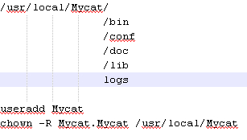
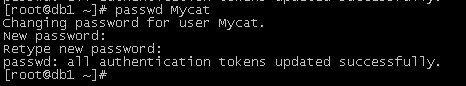
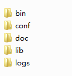
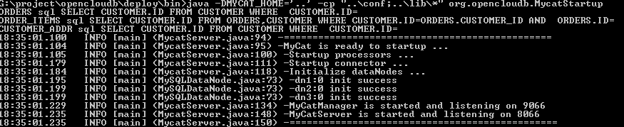

# 01-MyCat安装指南 - linux 版本

### 一、安装指南(安装单机)
Mycat的server和mysql位于同一台服务器，centos6.2.4环境

mycat依赖jdk1.7的环境，若本机没有，则需要下载安装：http://www.java.com/zh_CN/

Mysql Server 下载地址：http://dev.mysql.com/downloads/mysql/5.5.html#downloads

获取MyCAT的最新开源版本，项目主页：http://code.google.com/p/MyCAT/ 或 http://www.mycat.org.cn/

最新代码暂时在淘宝上托管，二进制包下载地址：http://code.taobao.org/svn/openclouddb/downloads/

windows下可以下载Mycat-server-xxxx.ZIP，linux下可以下载tar.gz解开在某个目录下，注意，目录不能有空格，在Linux(Unix)下，建议放在/usr/local/MyCAT目录下，如下面类似的：


下面是修改MyCat用户的密码方式（仅供参考）


MyCat 项目目录：

目录解释如下：    
Bin 程序目录，存放了window版本和linux版本，除了提供封装成服务的版本之外，也提供了nowrap的shell脚本命令，方便大家选择和修改，进入到bin目录：
- Windows 下 运行: mycat.bat  console 在控制台启动程序，也可以装载成服务，若此程序运行有问题，也可以运行startup_nowrap.bat，确保java命令可以在命令执行。
- Linux下运行：nohup sh  mycat  console &,首先要chmod +x mycat

Warp方式的命令，可以安装成服务并启动或停止。
- mycat install (可选)
- mycat start

注意，wrap方式的程序，其JVM配置参数在conf/wrap.conf中，可以修改为合适的参数，参数调整参照http://wrapper.tanukisoftware.com/doc/english/properties.html。用下面是一段实例：

> 注：mycat必须依赖jdk1.7，在1.6的情景下会报错，如果机器未升级可以指定jdk的目录，我考了一个jdk的包出来的，添加的绝对路径，根据情况定。
  wrapper.java.command=/usr/local/Mycat/jdk1.7.0/bin/java

```
# Java Additional Parameters
wrapper.java.additional.5=-XX:MaxDirectMemorySize=2G
wrapper.java.additional.6=-Dcom.sun.management.jmxremote
# Initial Java Heap Size (in MB)
wrapper.java.initmemory=2048
# Maximum Java Heap Size (in MB)
wrapper.java.maxmemory=2048
```
若启动报内存不够，可以试着将上述内存都改小，改为1G或500M。

---  
Conf目录下存放配置文件  
- server.xml是Mycat服务器参数调整和用户授权的配置文件，  
- schema.xml是逻辑库定义和表以及分片定义的配置文件，  
- rule.xml是分片规则的配置文件，分片规则的具体一些参数信息单独存放为文件，也在这个目录下。  

配置文件修改，需要重启Mycat或者通过9066端口reload。

日志存放在logs/mycat.log中，每天一个文件，日志的配置是在conf/log4j.xml中，根据自己的需要，可以调整输出级别为debug，debug级别下，会输出更多的信息，方便排查问题。

启动Mysql，确保能正常登录访问数据，msyql命令行工具mysql\bin\mysql.exe建议加入PATH路径中，为了方便使用。

> 注意：若是LINUX版本的MYSQL，则需要设置为Mysql大小写不敏感，否则可能会发生表找不到的问题。
　lower_case_table_names = 1

### 二、更改mycay配置信息
编辑MYCAT_HOME/conf/schema.xml文件，修改dataHost对应的连接信息：
```xml
<dataNode name="dn1" dataHost="localhost1" database="db1" />
<dataNode name="dn2" dataHost="localhost1" database="db2" />
<dataNode name="dn3" dataHost="localhost1" database="db3" />
<dataHost name="localhost1" maxCon="1000" minCon="10" balance="0"
          writeType="0" dbType="mysql" dbDriver="native" switchType="1"  slaveThreshold="100">
    <heartbeat>select user()</heartbeat>
    <!-- can have multi write hosts -->
    <writeHost host="hostM1" url="localhost:3306" user="root" password="123456">
        <!-- can have multi read hosts -->
        <!--<readHost host="hostS2" url="192.168.1.200:3306" user="root" password="xxx" />-->
    </writeHost>
</dataHost>
```
注意writeHost/readHost中的location,user,password的值符合你所采用的Mysql的连接信息。

修改完成后保存，进入到MYCAT_HOME/bin目录下，执行启动命令：startup.bat ，启动成功以后显示如下信息：

注意，默认数据端口为8066，管理端口为9066。

客户端也可以用图形化的客户端如：mysqlworkbench、 navicat 、以及一些基于Java的数据库客户端来访问，注意要填写端口号8066，以及database 为TESTDB。

命令行运行：mysql -utest -ptest -h127.0.0.1 -P8066 -DTESTDB  就能访问OpenCloudDB了，以下操作都在此命令行里执行（JDBC则将mysql的URL中的端口3306改为8066即可）

> 提示：访问MyCAT的用户账号和授权信息是在conf/server.xml文件中配置，而MyCAT用来连接后端MySQL库的用户名密码信息则在conf/schema.xml中，这是两套完全独立的系统，类似的还有MyCAT的逻辑库(schema)，逻辑表（table）也是类似的。

