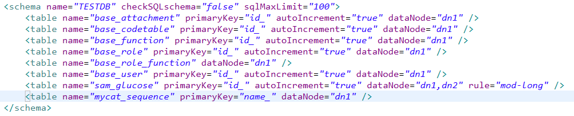
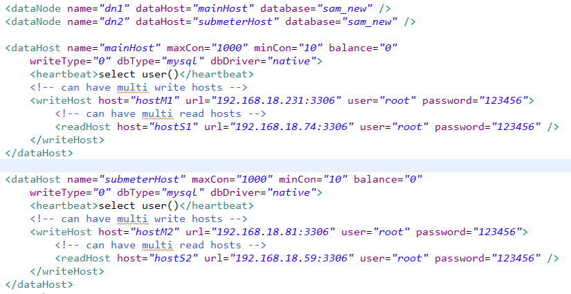
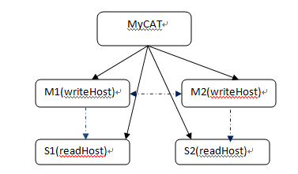

### 数据库映射与配置
MyCAT逻辑库相关概念：
- schema:逻辑库，与MySQL中的Database（数据库）对应，一个逻辑库中定义了所包括的Table。
- table：表，即物理数据库中存储的某一张表，与传统数据库不同，这里的表格需要声明其所存储的逻辑数据节点DataNode，这是通过表格的分片规则定义来实现的，table可以定义其所属的“子表(childTable)”，子表的分片依赖于与“父表”的具体分片地址，简单的说，就是属于父表里某一条记录A的子表的所有记录都与A存储在同一个分片上。
- 分片规则：是一个字段与函数的捆绑定义，根据这个字段的取值来返回所在存储的分片（DataNode）的序号，每个表格可以定义一个分片规则，分片规则可以灵活扩展，默认提供了基于数字的分片规则，字符串的分片规则等。
- DataNode：MyCAT的逻辑数据节点，是存放table的具体物理节点，也称之为分片节点，通过DataSource来关联到后端某个具体数据库上，一般来说，为了高可用性，每个DataNode都设置两个DataSource，一主一丛，当主节点宕机，系统自动切换到从节点。
- DataSource：定义某个物理库的访问地址，用于捆绑到Datanode上。


table节点中各属性说明：
- name：指定物理表名称；
- primaryKey：指定物理表主键名称；
- autoIncrement：指定主键是否采用自增长策略，如果不需要自增长可不用配置；
- dataNode：指定表所在的逻辑数据节点，如果有多个节点可使用逗号分隔，也可使用表达式dn$0-99 指定在0-99这100个节点上都使用(如果是一个节点上有多个库可使用db1$0-99)；
- rule：指定路由规则；

逻辑数据节点与物理主机配置：

dataNode节点中各属性说明：
- name：指定逻辑数据节点名称；
- dataHost：指定逻辑数据节点物理主机节点名称；
- database：指定物理主机节点上。如果一个节点上有多个库，可使用表达式db$0-99，	   表示指定0-99这100个数据库；

dataHost 节点中各属性说明：
- name：物理主机节点名称；
- maxCon：指定物理主机服务最大支持1000个连接；
- minCon：指定物理主机服务最小保持10个连接；
- writeType：指定写入类型；
    - 0，只在writeHost节点写入；
    - 1，在所有节点都写入。慎重开启，多节点写入顺序为默认写入根据配置顺序，第一个挂掉切换另一个；
- dbType：指定数据库类型；
- dbDriver：指定数据库驱动；
- balance：指定物理主机服务的负载模式。
    - 0，不开启读写分离机制；
    - 1，全部的readHost与stand by writeHost参与select语句的负载均衡，简单的说，当双主双从模式(M1->S1，M2->S2，并且M1与 M2互为主备)，正常情况下，M2,S1,S2都参与select语句的负载均衡；
    - 2，所有的readHost与writeHost都参与select语句的负载均衡，也就是说，当系统的写操作压力不大的情况下，所有主机都可以承担负载均衡；

一个dataHost元素，表明进行了数据同步的一组数据库，DBA需要保证这一组数据库服务器是进行了数据同步复制的。writeHost相当于Master DB Server，而其下的readHost则是与从数据库同步的Slave DB Server。当dataHost配置了多个writeHost的时候，任何一个writeHost宕机，Mycat 都会自动检测出来，并尝试切换到下一个可用的writeHost；

MyCAT支持高可用性的企业级特性，根据您的应用特性，可以配置如下几种策略：
- 后端数据库配置为一主多从，并开启读写分离机制；
- 后端数据库配置为双主双从（多从），并开启读写分离机制；
- 后端数据库配置为多主多从，并开启读写分离机制；
后面两种配置，具有更高的系统可用性，当其中一个写节点（主节点）失败后，Mycat会侦测出来（心跳机制）并自动切换到下一个写节点，MyCAT在任何时候，只会往一个写节点写数据;

下面是典型的双主双从的Mysql集群配置：



### sequence设置与使用
在实现分库分表的情况下，MySql自增主键已无法保证自增主键的全局唯一，为此，MyCat 提供了全局sequence，并使用两种机制实现这种全局sequence，分别是文件形式和数据库形式。

#### sequence使用方式
Sequence名称：TEST_SEQ；
- 使用方式：select next value for MYCATSEQ_TEST_SEQ；
- 注意，使用时sequence名称前一定要加大写的“MYCATSEQ_”；

#### 文件形式
原理：此种方式MyCat将sequence配置到文件中，当使用到配置中的sequence后，MyCat会更新classpath中的sequence_conf.properties文件中的sequence当前值；

在sequence_conf.properties文件中做如下配置：
```
# self define sequence
TEST_SEQ.HISIDS=
TEST_SEQ.MINID=1001
TEST_SEQ.MAXID=2000
TEST_SEQ.CURID=1000
其中MINID：最小值； MAXID：最大值；CURID：当前值；
```
server.xml配置
```
<system>
    <property name="sequnceHandlerType">0</property>
</system>
sequnceHandlerType配置为0，表示使用文件形式；
```
缺点：当MyCat重新发布后，sequence会恢复到初始值；

#### 数据库形式
原理：此种方式是在数据库中建立一张表，存放sequence名称(name)，sequence当前值(current_value)，步长（increment  int类型每次读取多少个sequence，假设为K）等信息；

equence获取步骤：
- ❶、当初次使用该sequence时，根据传入的sequence名称，从数据库这张表中读取 	current_value，和increment到MyCat中，并将数据库中的current_value设置为原	current_value值+increment值；
- ❷、MyCat将读取到current_value+increment作为本次要使用的sequence值，下次使	用时，自动加1，当使用increment次后，执行步骤❶相同的操作；
MyCat负责维护这张表，用到哪些sequence，只需要在这张表中插入一条记录即可。若某次读取的sequence没有用完，系统就停掉了，则这次读取的sequence剩余值不会在使用；

配置方式：  
server.xml配置
```
<system>
    <property name="sequnceHandlerType">1</property>
</system>
sequnceHandlerType配置为1，表示使用数据库形式；
```

数据库配置:
建立sequence相关表和函数，具体如附件:
MyCatSequence.sql

sequence_db_conf.properties文件配置：    
指定sequence相关表和函数在哪个节点上：Test_SEQ=dn1

#### sequence使用
目前mycat中支持配置全局sequence和自定义sequence两种方式。

使用默认的全局sequence : 
```
insert into tb1(id,name) values(next value for MYCATSEQ_GLOBAL,'micmiu.com');
```
使用默认的全局sequence : 
```
insert into tb1(id,name) values(next value for MYCATSEQ_GLOBAL,'micmiu.com');
```
使用自定义的 sequence : 
```
insert into tb2(id,name) values(next value for MYCATSEQ_MY1,'micmiu.com');
```
注：在没有特殊需求的情况下，建议每个表都使用自定义的sequence，每个表配置一个，这样比较方便管理和维护；

#### autoIncrement开启
 在mycat中使用主键自增长需要在schema.xml的table节点中的autoIncrement设置为true表示开启主键自增长策略；

### catlet支持
通过catlet支持跨分片复杂SQL实现以及存储过程支持等。使用方式主要通过mycat注释的方式来执行，如下：

#### 1. 跨分片联合查询注解支持：
```
/*!mycat:catlet=demo.catlets.ShareJoin */ select bu.*,sg.* from base_user bu,sam_glucose sg where bu.id_=sg.user_id；
注：sam_glucose 是跨分片表；
```

#### 2. 存储过程注解支持：
```
/*!mycat: sql=select * from base_user where id_=1;*/CALL proc_test();
```
注：目前执行存储过程通过mycat注解的方式执行，注意需要把存储过程中的sql写到注解中；

