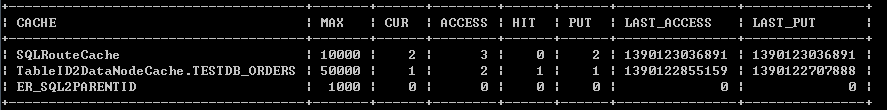
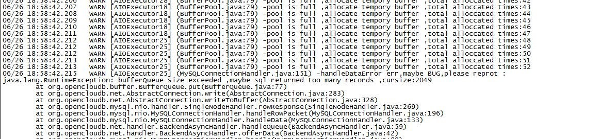
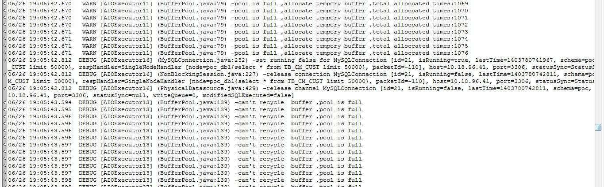

# MyCat性能调优

### JVM调优：    
内存占用分两部分:java堆内存+直接内存映射（DirectBuffer占用），建议堆内存适度大小，直接映射内存尽可能大，两种一起占据操作系统的1/2-2/3的内存。

下面以服务器16G内存为例，Mycat堆内存4G，直接内存映射6G，JVM参数如下：
```
-server -Xms4G –Xmx4G   XX:MaxPermSize=64M -XX:MaxDirectMemorySize=6G
```

用mycat console等命令启动MyCAT的，JVM参数都在conf\wrapper.con(/doc/进阶文档/wrapper.conf)文件中，下面是一段实例：
```
下面是一段实例：
# Java Additional Parameters
wrapper.java.additional.5=-XX:MaxDirectMemorySize=2G
wrapper.java.additional.6=-Dcom.sun.management.jmxremote
# Initial Java Heap Size (in MB)
wrapper.java.initmemory=2048
# Maximum Java Heap Size (in MB)
wrapper.java.maxmemory=2048
```

### 操作系统调优
最大文件句柄数量的修改，设置为5000-1万，在Mycat Server和Mysql数据库的机器上都设置。Linux操作系统对一个进程打开的文件句柄数量的限制(也包含打开的SOCKET数量,可影响MySQL的并发连接数目).这个值可用ulimit命令来修改，但ulimit命令修改的数值只对当前登录用户的目前使用环境有效,系统重启或者用户退出后就会失效。

### Mysql调优
最大连接数设置为2000

[mysqld]中有参数
```
max_connections = 2000

mysql> show global status like 'Max_used_connections';
```
MySQL服务器过去的最大连接数是245，没有达到服务器连接数上限256，应该没有出现1040错误，比较理想的设置是：
```
Max_used_connections / max_connections * 100% ≈ 85%
```
最大连接数占上限连接数的85%左右，如果发现比例在10%以下，MySQL服务器连接上线就设置得过高了。


### Mycat调优
Conf/log4j.xml中，日志级别调整为至少info级别，默认是debug级别，用于排查错误，不能用于性能测试和正式生产中。

conf/server.xml中 有如下参数可以调整：
```xml
<system>
    <!— CPU核心数越多，可以越大，当发现系统CPU压力很小的情况下，可以适当调大此参数，如4核心的4CPU，可以设置为16，24核心的可以最大设置为128——>
    <property name="processors">1</property>
    <!— 下面这个参数为每个processor的线程池大小，建议可以是16-64，根据系统能力来测试和确定。 ——>
    <property name="processorExecutor">16</property>
</system>
```

System中以下重要参数也根据情况进行调整：    
- processorBufferPool ：每个processor分配的Socket Direct Buffer，用于网络通信，每个processor上管理的所有连接共享，processorBufferChunk为Pool的最小分配单元，每个POOL的容量即为processorBufferPool/processorBufferChunk，默认前者为1024 * 1024 * 16=16M，后者为4096字节。processorBufferPool参数的调整，需要观察show @@processor的结果来确定：
- BU_PERCENT为已使用的百分比、BU_WARNS为Socket Buffer Pool不够时，临时创新的新的BUFFER的次数，若百分比经常超过90%并且BU_WARNS>0，则表明BUFFER不够，需要增大processorBufferPool。基本上，连接数越多，并发越高，需要的POOL越大，建议BU_PERCENT最大在40-80%之间。

conf/schema.xml中有如下参数可以调整：      
```
<schema name="TESTDB" checkSQLschema="true"> 
```
checkSQLschema属性建议设置为false，要求开发中，不能在sql中添加数据库的名称，如select * from TESTDB.company，这样可以优化SQL解析。

```
<dataHost name="localhost1" maxCon="500" minCon="10" balance="0" 
		dbType="mysql" dbDriver="native" banlance="0">
```
最大连接池maxCon，可以改为1000至2000，同一个Mysql实例上的所有datanode节点的共享本dataHost 上的所有物理连接.    
性能测试的时候，建议minCon=maxCon= mysql max_connections设为2000左右。另外，读写分离是否开启，根据环境的配置来决定。


### 缓存优化调整
```
Show @@cache
```
命令展示了缓存的使用情况，经常观察其结果，需要时候进行调整：


一般来说：若CUR接近MAX，而PUT大于MAX很多，则表明MAX需要增大，HIT/ACCESS为缓存命中率，这个值越高越好。重新调整缓存的最大值以后，观测指标都会跟随变化，调整是否有效，主要观察缓存命中率是否在提升，PUT则下降。

目前缓存服务的配置文件为：cacheservice.properties(/doc/进阶文档/cacheservice.properties)，主要使用的缓存为enhache，enhache.xml里面设定了enhance缓存的全局属性，下面定义了几个缓存：
```
#used for mycat cache service conf
factory.encache=org.opencloudb.cache.impl.EnchachePooFactory
#key is pool name ,value is type,max size, expire seconds
pool.SQLRouteCache=encache,10000,1800
pool.ER_SQL2PARENTID=encache,1000,1800
layedpool.TableID2DataNodeCache=encache,10000,18000
layedpool.TableID2DataNodeCache.TESTDB_ORDERS=50000,18000
```

- SQLRouteCache为SQL 解析和路由选择的缓存，这个大小基本相对固定，就是所有SELECT语句的数量。
- ER_SQL2PARENTID为ER分片时候，根据关联SQL查询父表的节点时候用到，没有用到ER分片的，这个缓存用不到。
- TableID2DataNodeCache，当某个表的分片字段不是主键时，缓存主键到分片ID的关系，这个是二层的缓存，每个表定义一个子缓存，如”TEST_ORDERS”，这里命名为schema_tableName（tablename要大写），当有很多的根据主键查询SQL时，这个缓存往往需要设置比较大，才能更好的提升性能。


#### Mycat大数据量查询调优
1、返回结果比较多


建议调整 frontWriteQueueSize 在系统许可的情况下加大，默认值*3



这个原因是因为返回数据太多。这里做了一个改进，就是超过POOL以后，仍然创建临时的BUFFER供使用，但这些不回收。
这样的情况下，需要增加BUFFER参数，调整 processorBufferPool = 默认值*2，不够的情况下，继续加大。


