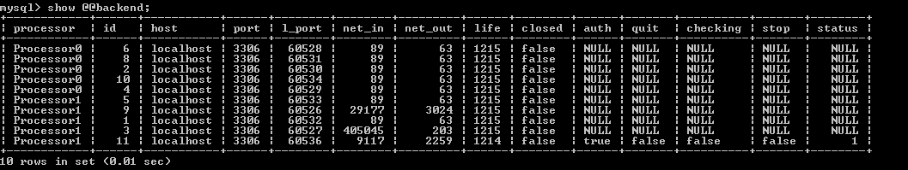
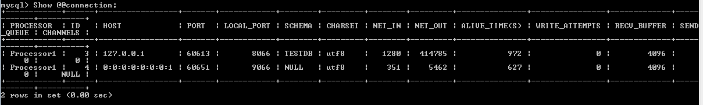
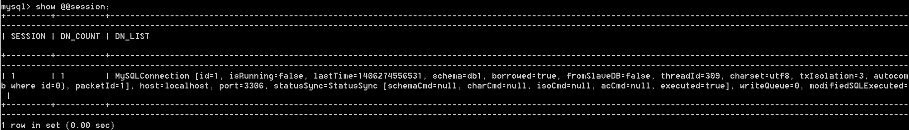
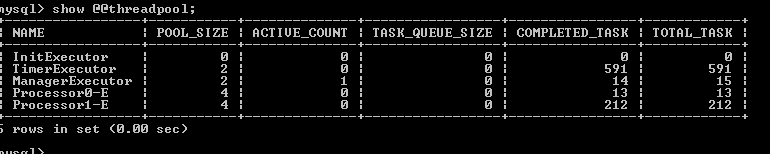
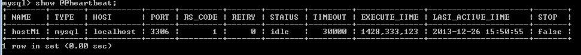
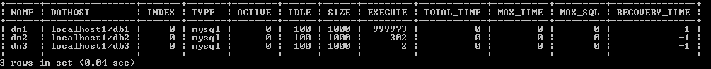
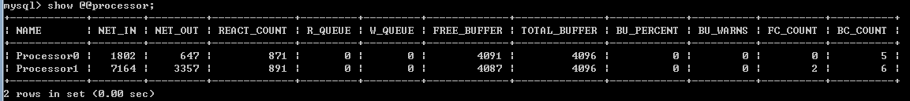
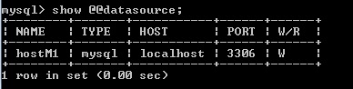
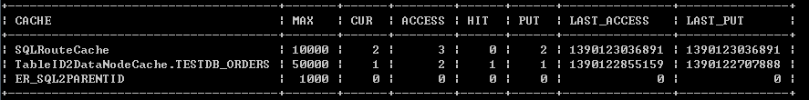

# 03-MyCat命令行监控

9066端口 ，用mysql命令行连接
```
Mysql –utest –ptest –P9066
```

```
show @@help 
```
可显示所有相关管理命令


```
Show @@backend
```
显示后端物理库连接信息，包括当前连接数，端口



```
Show @@connection
```
显示当前前端客户端连接情况，已经网络流量信息



```
Show @@session
```
显示当前没有结束的会话，如事务模式下，还未提交事务的，以及有SQL还未返回的等相信信息，其中id为show @@connection里的前端连接的ID，此命令有助于排除异常SQL和事务问题。

DN_COUNT 为分片记录个数，DN_LIST为后端MYSQL的连接列表。



```
Show @@threadpool
```
当前线程池的执行情况，是否有积压(active_count)以及task_queue_size，后者为积压的待处理的SQL，若积压数目一直保值，则说明后端物理连接可能不够或者SQL执行比较缓慢。



```
Show @@heartbeat
```
当前后端物理库的心跳检测情况,RS_CODE为1表示心跳正常



```
Show @@datanode
```
显示数据节点的访问情况，包括每个数据节点当前活动连接数(active),空闲连接数（idle）以及最大连接数(maxCon) size，EXECUTE参数表示从该节点获取连接的次数，次数越多，说明访问该节点越多。


```
Show @@processor
```
显示当前processors的处理情况，包括每个processor的IO吞吐量(NET_IN/NET_OUT)、IO队列的积压情况(R_QUEY/W_QUEUE)，Socket Buffer Pool的使用情况BU_PERCENT为已使用的百分比、BU_WARNS为Socket Buffer Pool不够时，临时创新的新的BUFFER的次数，若百分比经常超过90%并且BU_WARNS>0，则表明BUFFER不够，需要增大，参见性能调优手册。



```
Show @@datasource
```
显示数据源的信息，是否是读写节点等。



```
show @@cache
```
显示缓存的使用情况，对于性能监控和调优很有价值

MAX为缓存的最大值（记录个数），CUR为当前已经在缓存中的数量，ACESS为缓存读次数，HIT为缓存命中次数，PUT 为写缓存次数，LAST_XX为最后操作时间戳，比较重要的几个参数：CUR：若CUR接近MAX，而PUT大于MAX很多，则表明MAX需要增大，HIT/ACCESS为缓存命中率，这个值越高越好。


```
Kill @@connection 
```
杀掉客户端的连接，参数为连接的ID值，通过show @@connection，可以展示当前连接到MyCAT的所有客户端进程，若某个进程异常，则可以通过该命令杀掉连接，如
```
KILL @@CONNECTION 1;
```


